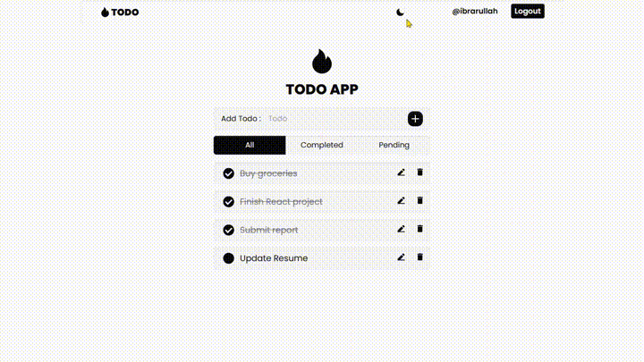

# Todo App

A simple and interactive Todo application built using React, Vite, and Context API. The app allows users to add, edit, delete, and filter their tasks, ensuring efficient task management.

## Demo 

Check out the app in action with both light and dark themes



Want to see it live? Head over to the [Todo App](https://todo-app-i.vercel.app)

## Features

- **Add Todos:** Easily add new tasks to your list.
- **Edit Todos:** Inline editing of tasks with updates made by pressing Enter.
- **Delete Todos:** Remove tasks that are no longer needed with a click.
- **Complete Todos:** Mark tasks as completed with a checkbox.
- **Filter Todos:** Filter tasks based on their completion status (completed or not completed).
- **Persistent Storage:** Todos are stored in `localStorage`, so they persist across page reloads.
- **Theme Switching:** Toggle between light and dark themes to suit your preference.


## Technologies Used

- **React:** A JavaScript library for building user interfaces.
- **Vite:** A modern build tool that provides fast development and optimized production builds.
- **Context API:** A React feature for managing global state and passing data through the component tree without props.
- **Tailwind CSS:** A utility-first CSS framework for designing custom user interfaces.
- **React Icons:** A library of icons for React applications, used for adding visual elements like edit, delete, and update icons.

## Project Structure
The project directory structure is as follows:

```bash
├── public
│   └── vite.svg 
├── src
│   ├── components
│   │   ├── Header.jsx     # Header component
│   │   ├── Layout.jsx     # Layout component
│   │   ├── Todo.jsx       # Component for displaying individual todos
│   │   ├── TodoForm.jsx   # Form component for adding new todos
│   │   └── TodoWrapper.jsx # Component that wraps and displays the todo list and form
│   ├── context
│   │   ├── AuthContext.jsx   # Context for managing authentication state
│   │   ├── ThemeContext.jsx   # Context for managing theme state
│   │   └── TodosContext.jsx   # Context for managing todo items
│   └── pages
│       ├── Home.jsx 
│       ├── Login.jsx 
│       └── Signup.jsx 
├── App.jsx 
├── index.css 
├── main.jsx 
├── package.json
└── README.md
```